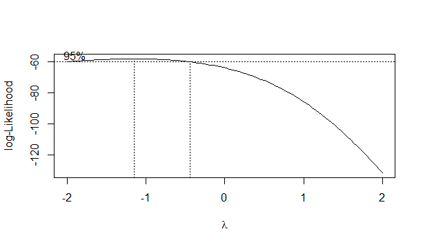
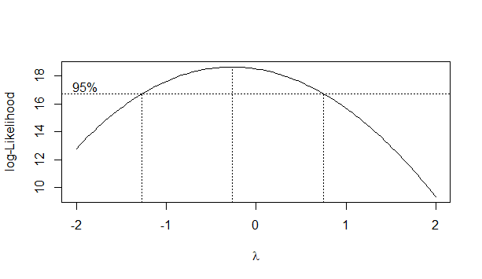

# Experimento 07 – Avaliação Agronômica de Genótipos de Bananeira Tipo Prata

Este repositório contém os dados, análises estatísticas e resultados referentes ao **Experimento 07**, realizado com sete genótipos de bananeira tipo Prata no Semiárido brasileiro.

## 📋 Descrição do experimento
- **Cultura:** Bananeira tipo Prata (porte alto)  
- **Local:** Perímetro Irrigado do Estreito, Sudoeste da Bahia  
- **Delineamento experimental:** Blocos casualizados (DBC)  
- **Tratamentos (genótipos):**
  - Pacovan (testemunha)  
  - Pacovan-Ken (PV42-68)  
  - Japira (PV42-142)  
  - Preciosa (PV42-85)  
  - PV42-53  
  - PV79-34  
  - Garantida (ST42-08)  
- **Número de repetições:** 10  
- **Número total de plantas úteis:** 70  
- **Espaçamento:** 3,0 m x 2,5 m  
- **Condução:** Mudas micropropagadas; irrigação por microaspersão; sem controle químico de Sigatoka-amarela.

### Variáveis avaliadas
1. Número de folhas (Nfolhas)  
2. Sigatoka-amarela (SigatAmar) – escala de 1 a 6 (quanto menor, melhor)  
3. Número de pencas (NPencas)  
4. Número de frutos (Nfrutos)  
5. Peso de cachos (kg, Pcachos) 

Fonte: Segue arquivo **"Texto-explicativo-experimento-07"** na presente pasta. 

---

## 📊 Análises estatísticas
As análises foram realizadas no software **R** com auxílio do pacote **ExpDes.pt** para as Anovas. **nortest** para as pressuposições e **MASS** para as transformações;
Foram verificadas as pressuposições de **normalidade dos resíduos** (teste de Lilliefors/Shapiro-Wilk) e **homogeneidade de variâncias** (teste de Bartlett).  
Quando necessário, aplicou-se transformação **Box-Cox**.

### Resultados resumidos:

#### 1. Número de folhas (Nfolhas)
- Normalidade **não atendida** inicialmente.  
- Após transformação Box-Cox (λ = -0.5), os resíduos atenderam normalidade e homogeneidade.  
- **Scott-Knott:** Pacovan e PV42-53 formaram o grupo superior.  

📈 

---

#### 2. Sigatoka-amarela (SigatAmar)
- **Normalidade e homogeneidade não atendidas** (mesmo após tentativa de transformação).  
- **Scott-Knott:** PV79-34 apresentou melhor desempenho (menor nota de severidade).  

📈 

---

#### 3. Número de pencas (NPencas)
- Pressuposições atendidas.  
- **Scott-Knott:** PV79-34, Pacovan e Japira entre os melhores.  

---

#### 4. Número de frutos (Nfrutos)
- Pressuposições atendidas.  
- **Scott-Knott:** PV79-34 destacou-se com maior número de frutos.  

---

#### 5. Peso de cachos (Pcachos)
- Resíduos **não atenderam normalidade**, mas variâncias homogêneas.  
- **Scott-Knott:** Preciosa apresentou maior peso médio de cachos.

📈 
 

---

## 📂 Estrutura do repositório
```
📁 Experimento_07
 ┣ 📄 README.md                                       <- Descrição do estudo
 ┣ 📊 Dados_Experimento_07.xls                        <- Base de dados
 ┣ 📄 Dados G7.doc                                    <- Detalhes do experimento
 ┣ 📈 gráfico-box-cox-Nfolhas-experimento-07.png      <- Gráficos indicativos do valor lambda
 ┣ 📈 gráfico-box-cox-SigatAmar-experimento-07.png       para a transformação dos dados
 ┣ 📈 gráfico-box-Pcachos-experimento-07.png
 ┗ 📜 script_analise.R                                <- Script em R para análise
```

---

## 🚀 Reprodutibilidade
Para reproduzir as análises, basta abrir o script `script_analise.R` no **R** e executar.  
Bibliotecas necessárias:
```R
library(ExpDes.pt)
library(nortest)
library(MASS)
```

---

## 📌 Conclusões preliminares
- A transformação Box-Cox foi necessária para **Nfolhas**, corrigindo os resíduos.  
- A variável **SigatAmar** apresentou sérios desvios das pressuposições, mesmo após transformações.  
- O genótipo **PV79-34** destacou-se em número de frutos e resistência à Sigatoka-amarela.  
- A cultivar **Preciosa** apresentou maior peso de cachos.  
